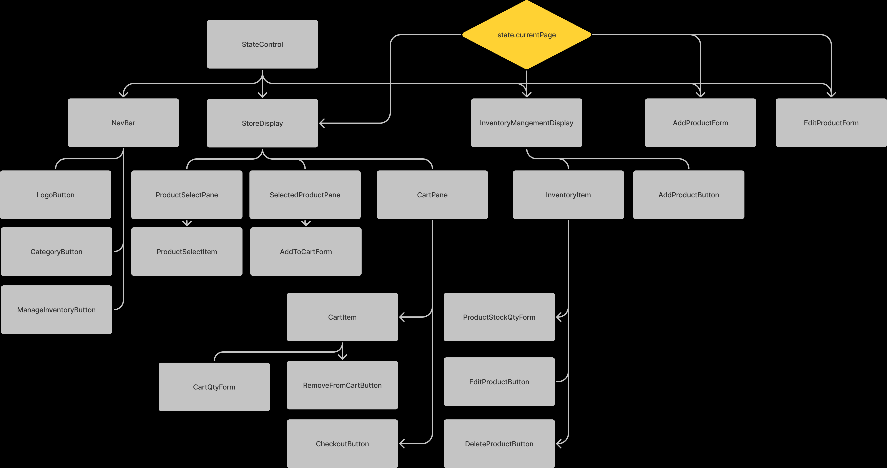

# _Cat-Merch_

#### By _**Aaron Minnick, Liz Thomas, Kim Brannian, Jacob Wilson**_

#### _A mock website for cat based merchandise._

## Technologies Used

* _React_
* _JavaScript_
* _HTML_
* _CSS_
* _Markdown_
* _Bootstrap_
* _Webpack_
* _Lint_

## Description

_A project designed for with the purpose of practicing react. The application has full crud functionality, and emphasizes practicing using components in a larger scale application_

## Systems Diagrams

## Setup/Installation Requirements

* _You can find the github repository [here](https://github.com/JLEWilson/cat-merch)_
* _Click the code button, and copy the https link_
* _In your in git bash or your preferred git terminal navigate to the directory you would like to store the project_
* _Enter: "git clone" followed by the https link_
* _Now that the repository is cloned to your computer, right click on the folder and click open with vs code_
* _Now type npm install in your terminal to install the packages used in the project, you may have to run install twice due to the size of the packages_
* _You can now view the project by typing npm run start in your terminal_

## Known Bugs

* _No known bugs_

## License - [MIT](https://opensource.org/licenses/MIT)

_If you run into any problems or find a bug, would like to reach me for a separate reason, feel free to send me an email @jacobleeeugenewilson@gmail.com with details of your issue._

Copyright (c) _02/10/2022_ _Aaron Minnick, Liz Thomas, Kim Brannian, Jacob Wilson_